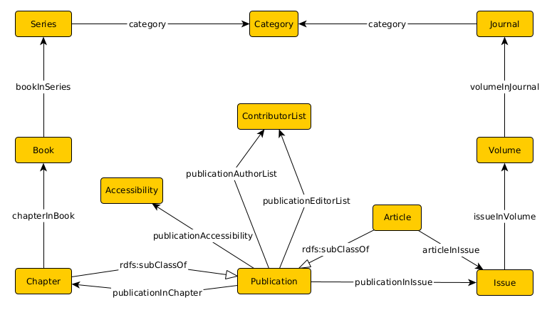
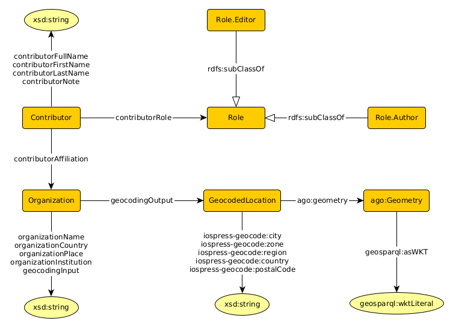
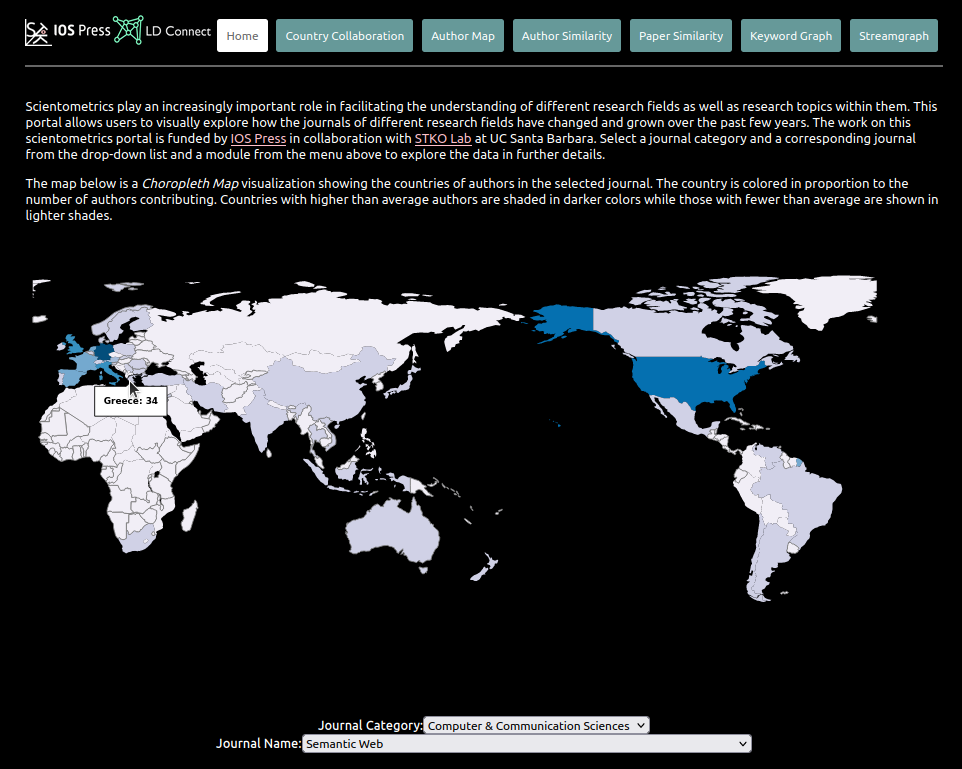
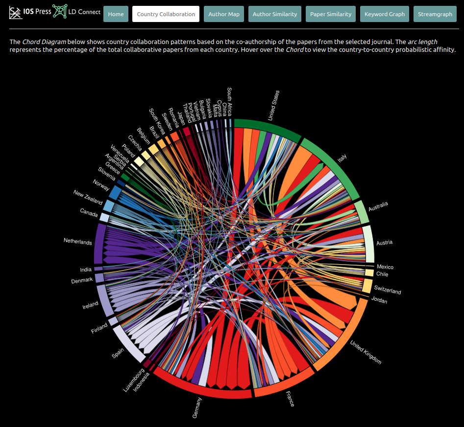
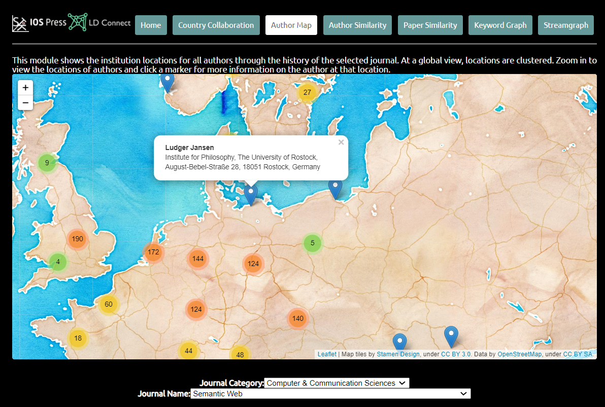
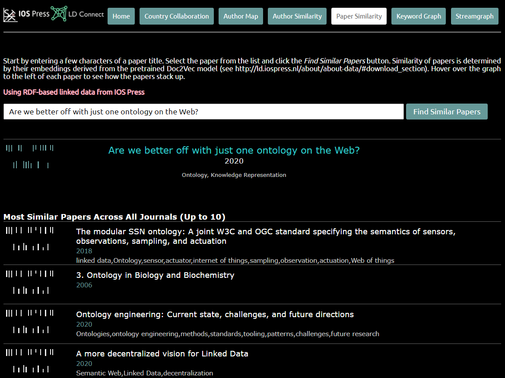
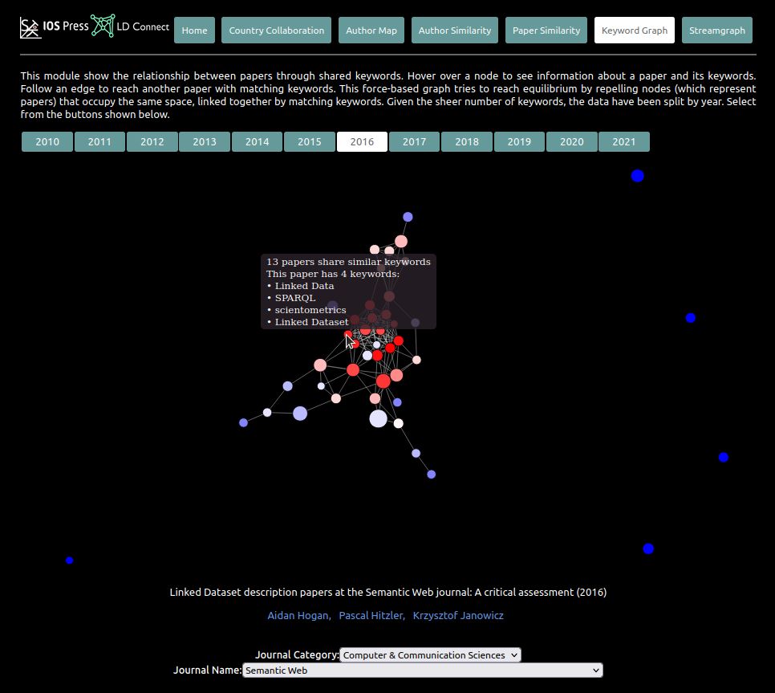
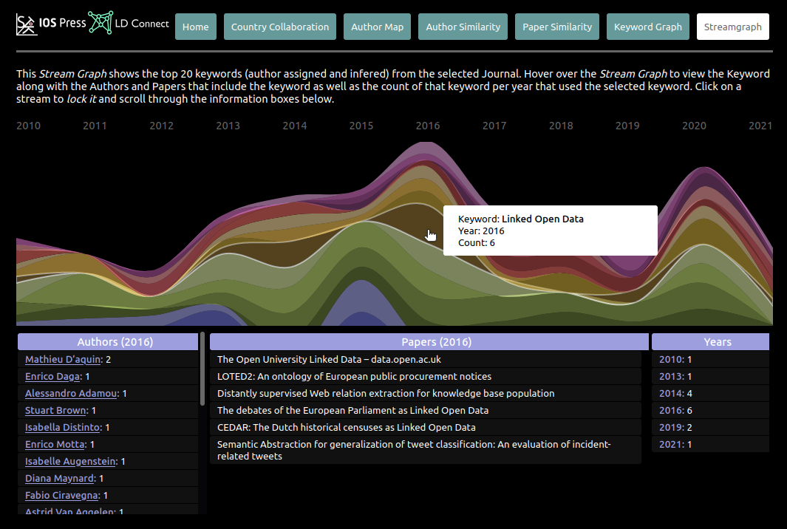

# LD-Connect
[LD Connect](http://ld.iospress.nl/) is a Linked Data portal for [IOS Press scientometrics](http://stko-roy.geog.ucsb.edu:7200/iospress_scientometrics), consisting of all IOS Press bibliographic data enriched with geographic information. This is a work funded by [IOS Press](https://www.iospress.com/) in collaboration with the [STKO lab](https://github.com/stko-lab) at [UC Santa Barbara](https://www.ucsb.edu/). A SPARQL endpoint for retrieving information in LD Connect is published as [`http://ld.iospress.nl/sparql`](http://ld.iospress.nl/sparql). In this documentation, we provide descriptions about the shared data and scientometric system along with instructions on how to reuse it. The shared data includes ontology, triples, and embeddings, which can be accessed in our [figshare repository](https://doi.org/10.6084/m9.figshare.20409111). To use the shared data, please download it first and put it inside the root folder of this Github repository. More information about our work is provided in our <span style="color:red">Spotlight Paper</span> "LD Connect: A Linked Data Portal for IOS Press Scientometrics" accepted by [ESWC 2022](https://2022.eswc-conferences.org/). 

## Ontology
The ontology triple can be found at `data/ontology/ontology.ttl`. Two schema diagrams below show ontology fragments of [`iospress:Publication`](http://ld.iospress.nl/rdf/ontology/Publication) and [`iospress:Contributor`](http://ld.iospress.nl/rdf/ontology/Contributor) respectively. In addition, we include a recent collection of selected triples in `data/triples/` that are extracted from LD Connect for convenience of reuse. The `categories.ttl` contains triples about the mapping between a [`iospress:Journal`](http://ld.iospress.nl/rdf/ontology/Journal) and corresponding [`iospress:Category`](http://ld.iospress.nl/rdf/ontology/category), `geocoded.ttl` contains geocoded information about [`iospress:Organization`](http://ld.iospress.nl/rdf/ontology/Organization), and `triplify-union.ttl` contains the union of all triples LD Connect consisted of (at the time of data collection).

<div align=center>

</div>

<div align=center>

</div>

<p align = "center">
Fig.1 An overview of the ontology behind LD Connect. Edges with filled arrows are object/datatype properties; and edges with open arrow heads represent subclass relations. All classes and properties without any prefix are in the namespace iospress: http://ld.iospress.nl/rdf/ontology/ .
</p>

Semantic search is available at [`http://ld.iospress.nl/explore/semantic-search/`](http://ld.iospress.nl/explore/semantic-search/). A sample SPARQL query is provided below, which is used to retrieve information about papers whose first author is from affiliations located in China.
```SPARQL
select ?title (group_concat(?keyword; separator=',')
       as ?keywords) ?year ?journal ?first_author_name ?org_name 
{
    ?paper iospress:publicationTitle ?title;
           iospress:publicationIncludesKeyword ?keyword;
           iospress:publicationDate ?date;
           iospress:articleInIssue/iospress:issueInVolume/
           iospress:volumeInJournal ?journal;
           iospress:publicationAuthorList ?author_list.
    ?author_list rdf:_0 ?first_author.
    ?first_author iospress:contributorFullName ?first_author_name;
                  iospress:contributorAffiliation ?org.
    ?org iospress:geocodingInput ?org_name ;
		 iospress:geocodingOutput/
		 iospress-geocode:country ?org_country.    
    bind(year(?date) as ?year)
    values ?org_country {"China"@en}
} group by ?title ?year ?journal ?first_author_name ?org_name
```

## Embeddings
A version of pre-trained embeddings are located in `data/embeddings/`. We have provided document embeddings in plain text format (see `data/embeddings/IOS-Doc2Vec-TXT/`). The `doc2vec.txt` is the Doc2Vec model. The `doc2vec_voc.txt` contains a list of all the paper entity URLs of the document embeddings. The `w2v.txt` is the corresponding Word2Vec model. The `w2v_voc.txt` contains a list of the word vocabulary of the word embeddings. In addition, we provide knowledge graph embeddings in plain text format as well (see `data/embeddings/IOS-TransE/`). Specifically, the graph embeddings `TransE_person.txt` provided consist of contributor information. Also, `entity_sameAs_merge_mapping_iri.json` is a JSON file about how same entities (e.g., contributors, affiliations, etc.) are linked after co-reference resolution. The dimension of all embeddings is 200.

To explore how embeddings unleash the power of IOS Press data, please refer to [`server.js`](scientometrics/src/server/server.js), [`mod-author-similarity.js`](scientometrics/src/static/js/mod-author-similarity.js), [`mod-paper-similarity.js`](scientometrics/src/static/js/mod-paper-similarity.js) to see how we achieve the embedding-based similarity search in our scientometric system.

## IOS Press scientometrics

### Getting started
IOS Press scientometrics are built upon LD Connect and developed by using several Javascript libraries such as [D3.js](https://d3js.org/) and [Leaflet](https://leafletjs.com/). The scientometrics can be downloaded from the [`scientometrics`](scientometrics/) folder, migrated to other academic knowledge graphs and reused for relevant applications and research. Follow the instructions below to set it up and run locally.

1. After cloning this repository, type the following commands in the terminal.
	```console
	$ cd scientometrics/
	$ npm install
	```
2. Create a folder `data/` within [`scientometrics/sites/`](`scientometrics/sites/`). Copy both pre-trained embedding folders (including [`data/embeddings/IOS-Doc2Vec-TXT/`](data/embeddings/IOS-Doc2Vec-TXT/)) and [`data/embeddings/IOS-TransE/`](data/embeddings/IOS-TransE/)) to the `scientometrics/sites/data/` directory.
3. Launch the server on an open port:
	```console
	$ node src/server/server.js
	```
	You can modify the port by changing `N_PORT` in server.js. The default is set to be 7200.

4. Now, open a browser and navigate to `http://localhost:N_PORT/iospress_scientometrics`.


### Descriptions
IOS Press scientometrics can be accessed through [`http://stko-roy.geog.ucsb.edu:7200/iospress_scientometrics`](http://stko-roy.geog.ucsb.edu:7200/iospress_scientometrics). Note that the HTTP header should be used instead of HTTPS. 

These scientometrics include Home (a choropleth map), Country Collaboration, Author Map, Author Similarity, Paper Similarity, Keyword Graph and Streamgraph. Please select a journal category first and then a journal of interest for bibliographic analysis, visualization and embedding-based similarity search. An example about how information is displayed for the Semantic Web journal are attached below.

<div align=center>

</div>

<div align=center>

</div>

<div align=center>

</div>

<div align=center>

</div>

<div align=center>

</div>

<div align=center>

</div>

<div align=center>

</div>

## License
This work is licensed under the Creative Commons Attribution-NonCommercial 4.0 International License. To view a copy of this license, visit http://creativecommons.org/licenses/by-nc/4.0/ or send a letter to Creative Commons, PO Box 1866, Mountain View, CA 94042, USA.
